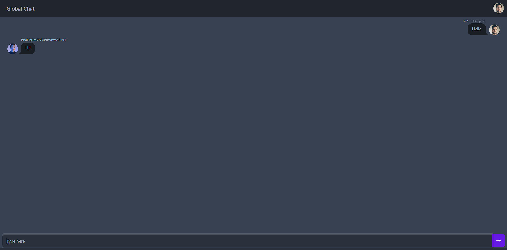

# Simple Chat App

Chat App is a real-time messaging application built with React for seamless communication.

## Features

- **Real-Time Messaging:** Engage in instant conversations with other users.
- **Responsive Design:** Enjoy a smooth chatting experience on various devices.

## Screenshots




## Installation

1. Clone this repository for chat app:

```bash
git clone https://github.com/your-username/chat-client.git
```

2. Navigate to the project directory: `cd chat-client`

3. Install dependencies: `npm install`

4. Start the application: `npm start`

5. Open your browser and visit `http://localhost:5173/` to view the chat application.

6. Clone this repository for chat server:
   
   ```bash
   git clone https://github.com/your-username/chat-server.git
   ```

7.  Navigate to the project directory: `cd chat-server`

8. Install dependencies: `npm install`

9. Start the application: `npm start`

10. Server is running at `http://localhost:3000/`

## Contributing

Contributions are welcome! If you have ideas for new features, improvements, or encounter issues, please create an issue or submit a pull request.
